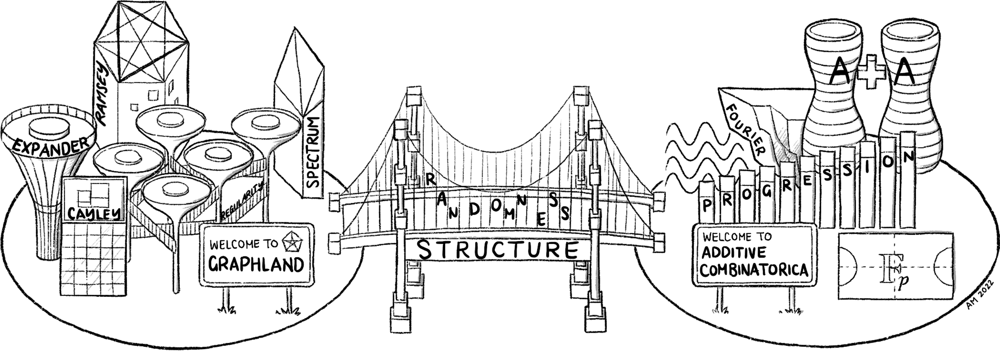

18.225 Graph Theory and Additive Combinatorics
===============================================

**Fall 2023, MIT, graduate level**

_Quick links:_
[\[Textbook\]](/gtacbook/)
[\[Canvas\]](https://canvas.mit.edu/courses/21524)

**Class meetings:** Mondays and Wednesdays 2:30--4pm, room 4-261

**Instructor:** [Prof. Yufei Zhao](http://yufeizhao.com)

**Graders:** TBA

**Emails and Piazza**
- For quick questions, please ask me after class.
- The class policy is to not answer by email any math questions related to the class, due to time constraints and also that emails are not a great medium for such Q&As (ask them during office hours instead).
- Clarification questions (about homework or lectures) should be asked on **Piazza** (link in Canvas), as they may benefit the rest of the class. The same goes for other discussions of general interest. Do not discuss hints or solutions to homework problems on Piazza until after the latest possible submission time after due date.
- For all homework-related questions (submission, extensions, grading, etc.), please email the lead grader
- Begin your email subject line with `[18.225]`

**Office hours**
- I will generally stay around after class to answer questions -- we may move to my office (2-271) if needed.
- I plan to hold regular office hours Fridays afternoons. Please see Canvas announcements for more information.
- You may ask me about unstarred problems (but not starred ones) during office hours. I will ask you to first explain on the board the progress you have made so far.

## Course description

The course examines classical and modern developments in graph theory and additive combinatorics, with a focus on topics and themes that connect the two subjects. The course also introduces students to current research topics and open problems.

A foundational result in additive combinatorics is **Roth's theorem**, which says that every subset of {1, 2, ..., _n_} without a 3-term arithmetic progression contains _o_(_N_) elements. We will see a couple of different proofs of Roth's theorem: (1) a graph theoretic approach and (2) Roth's original Fourier analytic approach. A central idea in both approaches is the **dichotomy of structure versus pseudorandomness**, and it is one of the key themes of the course.

Roth's theorem laid the groundwork for many important later developments, e.g.,
- **Szemerédi's theorem.** Every set of integers of positive density contains arbitrarily long arithmetic progressions;
- **Green--Tao theorem.** The primes contain arbitrarily long arithmetic progressions.

The course will explore these and related topics, including:

- **Extremal graph theory.** What is the maximum number of edges in a triangle-free graph on _n_ vertices? What if instead we forbid cycles of length 4? At most how many edges can an _n_-vertex graph have if every edge is contained in exactly one triangle?
- **Szemerédi's regularity lemma.** A powerful tool in combinatorics that provides an approximate description/decomposition for every large graph.
- **Pseudorandom graphs.** What does it mean for some graph to resemble a random graph?
- **Graph limits.** In what sense can a sequence of graphs, increasing in size, converge to some limit object?
- **Fourier analysis in additive combinatorics.** An important technique for studying combinatorial properties in arithmetic settings, e.g., in the proof of Roth's theorem. 
- **Freiman's theorem and the structure of sum sets.** What can one say about sets _A_ such that the sum set $$A + A = \{a + a' : a,a' \in A\}$$ is small?
- **Sum-product phenomenon.** Can a set _A_ simultaneously have both small sum set $$A + A$$ and product set $$A \cdot A$$?

Although the course will be largely divided into two parts (graph theory in the first half and additive combinatorics in the second), we will emphasize the interactions between the two topics and highlight the common themes.

**Textbook:** Yufei Zhao, [Graph Theory and Additive Combinatorics: Exploring Structure and Randomness](https://yufeizhao.com/gtacbook/), Cambridge University Press, 2023

**Lecture video recordings from Fall 2019** (may not correspond exactly to the current semester) may be found on
[MIT OpenCourseWare](https://ocw.mit.edu/18-217F19) 
and 
[YouTube](https://www.youtube.com/playlist?list=PLUl4u3cNGP62qauV_CpT1zKaGG_Vj5igX).

### Prerequisites
Mathematical maturity at the level of a first-year math graduate student.
Comfortable with undergraduate real analysis (18.100) and algebra (18.701/3).

### Grading

- Primarily based on [problem sets](#problem-sets)
  -  Only non-starred problems are considered for the calculations of letter grades other than A and A+
- The final grade may be adjusted up to ±5% at the end of term holistically based on:
  - [Research project proposal assignment](#research-project-proposal-assignment)
  - Participation (in class, office hours, and on Piazza)
- Final letter grade cutoffs: 
  * A− : ≥ 85%
  * B− : ≥ 70%
  * C− : ≥ 50%  
- Grades of A and A+ are awarded at my discretion based on overall performance
  - Solving a significant number of starred problems is a requirement for grades of A and A+ (please don't ask me what "a significant number" means). 
  - Official MIT grading policy: ± grade modifiers do not count towards the GPA and do not appear on the external transcript

Students needing support should consider reaching out to [Student Support Services (S3)](https://studentlife.mit.edu/s3), [GradSupport](https://oge.mit.edu/development/gradsupport/), or [Student Disability Services](https://studentlife.mit.edu/das).

## Problem sets

- See Dropbox link at the top of the page for homework problems.
- The problem set will be updated over the course of the semester. I will announce on Canvas when each problem set is complete.
- You should only submit the designated problems, but are encouraged to try the rest as well.
- Starred problems are generally more challenging.
- To get the most out of this course, you are expected to spend a significant amount of time solving these problems. It will be essential to start thinking about these problems early.

### Schedule

| Problem set | Due date  |
|:---------------:|:-----------:|
| PS 1 | Sun Sep 24
| PS 2 | Sun Oct 8
| PS 3 | Sun Oct 22
| PS 4 | Sun Nov 5
| PS 5 | Sun Nov 19
| PS 6 | Sun Dec 10

**Starred problems** on each problem set should be submitted separately, with an automatic 7-day extension without penalty (and no additional extensions permitted).

### Submissions

* Due time: **11:59pm of each due date**
* Must be typed in LaTeX and submitted as PDF on Gradescope (accessed from Canvas).
* Begin each solution on a new page
* State your sources at the top of each problem (even if you worked independently); see below
* Each box on the left-margin of the problem set PDF indicates a single problem worth 10 points

### Late policy

* **Penalty.** Late submissions will be penalized by 20% per each late day (24-hour increments, without fractional accounting).
  * Example: for an assignment due on Sunday, a submission worth _x_ points if turned in on time will be worth 0.6_x_ points points if submitted on Tuesday.
* **Multiple submissions.** You are allowed to submit up to two batches (i.e., 1 ontime + 1 late batch, or 2 separate late batches) and have the late penalty applied separately.
   * Please email the graders with a list of your on-time and late problems
   * The final submission should include everything, with the ontime and late problems clearly marked in the PDF,
   * The second batch may not contain any updates or replacement to an already submitted problem.
   * Please email the lead grader if you submit in two batches, with details on which problems are submitted in which batch, as multiple submissions complicate our grading process.
   * This policy is provided as a courtesy; it may be rescinded if abused.
* **Extensions.** If you need an extension for valid excuses (e.g., unanticipated health or family issues), please email the lead grader and me **in advance** or have S3 send us a message. Let us know how many days extension you would need.
  * The class policy is to not grant extension based on forseeable circumstances including other academic workload, extracurriculars, and poor study habits.

### Collaborations

- You are encouraged to first work on the homework problems independently before seeking collaboration.
- Meaningful collaboration is allowed if it helps with your learning (e.g., solving a problem together)
- Unacceptable practices include: "dividing up" the problems among a group and then distributing the solutions; asking for a solution from a friend.
- You must write up your own solutions.
- [Pset partners](https://psetpartners.mit.edu/) --- a tool for finding problem set collaborators (MIT Touchstone required)

### Acknowledging collaborators and sources

It is required to acknowledge your sources (even if you worked independently)

- At the beginning of the submission for **each problem**, write _Collaborators and sources:_ followed by a list of collaborators and sources consulted (people, books, papers, websites, software, etc.), or write _none_ if you did not use any such resources.
- Failure to acknowledge will result in an automatic 1pt penalty per problem.
- Acceptable uses of resources include: looking up a standard theorem/formula/technique; using Wolfram Alpha/Mathematica/Python for a calculation (no need to mention lectures or book draft)
- Unacceptable uses of resources include: directly looking up the problem online or in the research literature for a solution.
(Once you have solved a problem, it is fine to seek and learn alternate solutions.)

Intentional violations of the above policies may be considered academic dishonesty/misconduct.

## Research project proposal assignment

- You will write a proposal for a research project on a topic related to this class.
  - Imagine a document that I can hand to a beginning grad student or an undergraduate researcher (UROP/SPUR/REU)
  - Your submission may actually be used for this purpose in the future
- **Due date:** the same time as ps6
  - You are welcome to submit the proposal anytime during the semester and then optionally work on the proposed project yourself
- **Page limit:** 2 pages + references
- **Grading:** part of the ±5% modifier
  - No submission = -5%
  - Limited effort and thought, more or less just problem statements copied from another source = negative modifier
  - "Meets expectations" = zero modifier
  - A proposal that I would be excited to implement = positive modifier

**Topic selection:**
- Either known open problems or new problems that you came up with
- Should be realistic for the intended audience 
  - Avoid big and famous open problems, unless you are proposing some interesting and tractable special cases
  - Pick a topic that you would be excited to work on yourself
- Come to office hours to discuss and hear ideas

**What should be in the proposal?**
- Background and motivation
  - Why is it interesting?
  - Survey existing literature
- Statements of problems and conjectures
  - Propose milestones
  - What would partial progress look like?
- Suggested background reading
- Some ideas for getting started
  - You'll need to spend some effort to think about the problem yourself in order to write a thoughtful proposal

**Ideas on where to find open problems**

- [List of Erdős problems](https://www.erdosproblems.com/all) by Tom Bloom
- [Erdős problems on graphs](https://mathweb.ucsd.edu/~erdosproblems/) by Fan Chung
- [Open Problems in Additive Combinatorics](https://ecroot.math.gatech.edu/E2S-01-11.pdf) by Croot and Lev
- Research papers, textbook, seminars (also videos online)
- Come to office hours

**Previous versions of the course:** 
[Fall 2017](fa17/),
[Fall 2019](fa19/),
[Fall 2021](fa21/)