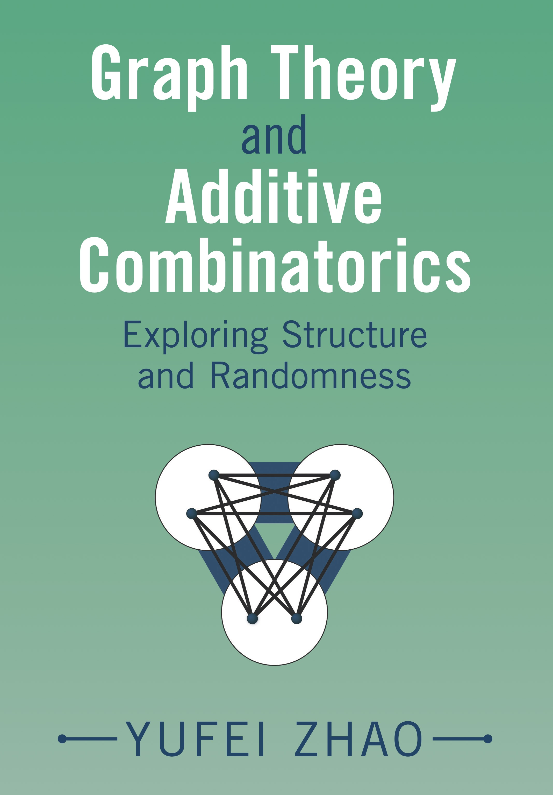

Graph Theory and Additive Combinatorics
===============================================
## Exploring Structure and Randomness

[Yufei Zhao](http://yufeizhao.com)

 &nbsp;&nbsp;
  

[Cambridge University Press](https://www.cambridge.org/core/books/graph-theory-and-additive-combinatorics/90A4FA3C584FA93E984517D80C7D34CA#fndtn-information) 2023

Bookstores:
[Amazon US](https://www.amazon.com/Graph-Theory-Additive-Combinatorics-Randomness/dp/1009310941/), 
[Amazon UK](https://www.amazon.co.uk/Graph-Theory-Additive-Combinatorics-Randomness/dp/1009310941), 
[Barnes & Noble](https://www.barnesandnoble.com/w/graph-theory-and-additive-combinatorics-yufei-zhao/1142747316)

Using the dichotomy of structure and pseudorandomness as a central theme, this accessible text provides a modern introduction to extremal graph theory and additive combinatorics. Readers will explore central results in additive combinatorics-notably the cornerstone theorems of Roth, Szemerédi, Freiman, and Green-Tao-and will gain additional insights into these ideas through graph theoretic perspectives. Topics discussed include the Turán problem, Szemerédi's graph regularity method, pseudorandom graphs, graph limits, graph homomorphism inequalities, Fourier analysis in additive combinatorics, the structure of set addition, and the sum-product problem. Important combinatorial, graph theoretic, analytic, Fourier, algebraic, and geometric methods are highlighted. Students will appreciate the chapter summaries, many figures and exercises, and freely available lecture videos on MIT OpenCourseWare. Meant as an introduction for students and researchers studying combinatorics, theoretical computer science, analysis, probability, and number theory, the text assumes only basic familiarity with abstract algebra, analysis, and linear algebra.

## [Book manuscript PDF](gtacbook.pdf)

Please submit errors and corrections on the [Google Form](https://bit.ly/gtac-form).

[Discord server: GTAC study group](https://discord.gg/nuR5WBps3T)

### Chapters

- Appetizer: Triangles and Equations
- Forbidding a Subgraph
- Graph Regularity Method
- Pseudorandom Graphs
- Graph Limits
- Graph Homomorphism Inequalities
- Forbidding 3-term Arithmetic Progressions
- Structure of Set Addition
- Sum-product Problem
- Progressions in Sparse Pseudorandom Sets

### Video lectures from Fall 2019 class:
- [MIT OpenCourseWare](https://ocw.mit.edu/18-217F19) 
- [YouTube](https://www.youtube.com/playlist?list=PLUl4u3cNGP62qauV_CpT1zKaGG_Vj5igX)

[Class website from Fall 2021](../gtac/)

[中文翻译 Chinese translation](https://zhuanlan.zhihu.com/p/461470594) of Fall 2019 lecture notes by Chenghua Liu (Tsinghua) and collaborators

### [Reviews](https://www.cambridge.org/core/books/graph-theory-and-additive-combinatorics/90A4FA3C584FA93E984517D80C7D34CA#fndtn-information)

‘Yufei Zhao does great mathematics and has an uncanny ability to explain the deepest results with clear understandable prose. For anyone interested in the seminal ideas (and their interrelationships) of recent decades - pseudorandomness, graphons, graph regularity, to name a few - this is the book to read and savor.’

_Joel Spencer - New York University_

‘This impeccable book should quickly become a classic text in discrete maths. A huge selection of topics is treated elegantly, with beautiful illustrations, and in just the `right' amount of detail to arouse the interest of the reader and leave them well-placed to find out more. In particular, the second half of the book is a superb introduction to additive combinatorics which I will happily recommend to any student in this area.’

_Ben Green - Oxford University_

‘This charming text gives an accessible introduction to the connected topics of extremal graph theory and modern additive combinatorics. The focus is very strongly on presenting intuition and restricting attention to the simplest possible instances of methods or classes of results, rather than aiming for maximal generality or the strongest statements; instead, references are given for further reading, or for the proofs of important theorems that are only stated here. Being highly suitable for advanced undergraduates or beginning graduate students, it fills a niche that is currently not occupied by other texts in these highly active areas of current mathematical research.’

_Terry Tao - University of California, Los Angeles_

‘A valuable and readable unified treatment of a fast-moving area of combinatorics from one of the world’s experts - sure to become a standard resource.’

_Jordan Ellenberg - University of Wisconsin-Madison_

‘Yufei Zhao's book is a wonderful book about graph theory, additive combinatorics, and their surprising connections involving a major theme of modern mathematics: the interplay between structure and randomness. In both areas, the book can take the curious reader, whether an advanced undergraduate or a professional mathematician, on a joyous journey from the very basics to state-of-the-art research. Yufei Zhao himself is a major player in modern research in both these areas and his presentation is a tour de force.’

_Gil Kalai - Hebrew University of Jerusalem and Reichman University_

‘This is a beautiful treatment of Extremal Graph Theory and Additive Combinatorics, focusing on the fruitful interplay between the two. The book covers the classical results as well as recent developments in this active area. It is a fascinating manuscript that would appeal to students and researchers with an interest in discrete mathematics, theoretical computer number theory, and related areas.’

_Noga Alon - Princeton University_

‘This is a wonderful, well-written account of additive combinatorics from the graph theoretic perspective. Zhao skillfully ties in this approach to the usual statements and gives a thorough development of the subject. This book is indispensable for any serious researcher in this area. Beginners will find a thorough account of the subject with plenty of motivation. The more experienced reader will appreciate the authors' insights and elegant development of some difficult ideas.’

_Andrew Granville - University of Montréal_