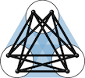

Class of 1956 Career Development Assistant Professor 
Department of Mathematics 
Massachusetts Institute of Technology

<strong>Email:</strong>


<strong>Office:</strong> <a href="http://whereis.mit.edu/?go=2" target="_blank">2-271</a>

<strong>Mail:</strong> 
MIT Department of Mathematics 
77 Massachusetts Ave, Bldg 2-271 
Cambridge, MA 02139, USA

## Research areas

Combinatorics, discrete mathematics, graph theory

[**My research blog**](https://yufeizhao.wordpress.com/)

**Co-organizer of [MIT Combinatorics Seminar](http://math.mit.edu/seminars/combin/)**

**Current PhD students**:
[Benjamin Gunby](http://www.math.harvard.edu/people/GunbyBenjamin.html),
[Jonathan Tidor](https://math.mit.edu/directory/profile.php?pid=2037)

## Teaching

**Current** (Fall 2018):

* [18.211 Combinatorial Analysis](211/)
* [18.A34 Mathematical Problem Solving (Putnam Seminar)](a34/)

**Upcoming** (Spring 2019):

* 18.218 Probabilistic Method in Combinatorics (grad)

**Previous**

* [18.S997 Graph Theory and Additive Combinatorics](gtac/) (grad), Fall 2017, MIT
* [Polynomial Method in Combinatorics](pm16/) (grad), Trinity Term 2016, Oxford

### [Math Olympiad training handouts](olympiad)

## Selected publications

* 
  [A relative Szemerédi theorem](http://arxiv.org/abs/1305.5440)
  (with David Conlon and Jacob Fox) \\
  _Geometric and Functional Analysis_ 25 (2015), 733--762.

* [Upper tails and independence polynomials in random graphs](http://arxiv.org/abs/1507.04074)
  (with Bhaswar B. Bhattacharya, Shirshendu Ganguly, and Eyal Lubetzky) \\
  _Advances in Mathematics_ 319 (2017), 313--347.

* [An $L^p$ theory of sparse graph convergence I: limits, sparse random graph models, and power law distributions](http://arxiv.org/abs/1401.2906)
  (with Christian Borgs, Jennifer T. Chayes, and Henry Cohn) \\
  _Transactions of the American Mathematical Society_, to appear.

* [Sphere packing bounds via spherical codes](http://arxiv.org/abs/1212.5966)
  (with Henry Cohn) \\
  _Duke Mathematical Journal_ 163 (2014), 1965--2002.

* [A reverse Sidorenko inequality](https://arxiv.org/abs/1809.09462) (with Ashwin Sah, Mehtaab Sawhney, and David Stoner)

## Videos

* <a href="javascript:void(0);" target="_self" onclick="$('#simons-talk-dec2013').toggle('fast');">
  Green-Tao theorem and a relative Szemerédi theorem</a>, Simons Institute, Berkeley, Dec 2013
  

  <iframe width="560" height="315" src="//www.youtube.com/embed/vsFFjhYLVrM" allowfullscreen></iframe>
  

* <a href="javascript:void(0);" target="_self" onclick="$('#simons-talk-jan2017').toggle('fast');">
  Sparse graph regularity tutorial</a>, Simons Institute, Berkeley, Jan 2017
  

  <iframe width="560" height="315" src="//www.youtube.com/embed/ZXLtAj4eL0c" allowfullscreen></iframe>
  

* <a href="javascript:void(0);" target="_self" onclick="$('#simons-talk-apr2017').toggle('fast');">
  Large deviations for arithmetic progressions</a>, Simons Institute, Berkeley, Apr 2017
  

  <iframe width="560" height="315" src="//www.youtube.com/embed/G9AJHUAz33o" allowfullscreen></iframe>
  

## Short CV

* [Dénes König Prize](https://www.siam.org/prizes/sponsored/konig.php), 2018
* Ph.D. Mathematics, MIT, 2015 (Advisor: [Jacob Fox](http://stanford.edu/~jacobfox/))
* M.A.St. Mathematics with Distinction, Cambridge, 2011
* S.B. Mathematics, MIT, 2010
* S.B. Computer Science and Engineering, MIT, 2010
* Previous institutions: Oxford, Berkeley, Microsoft Research
