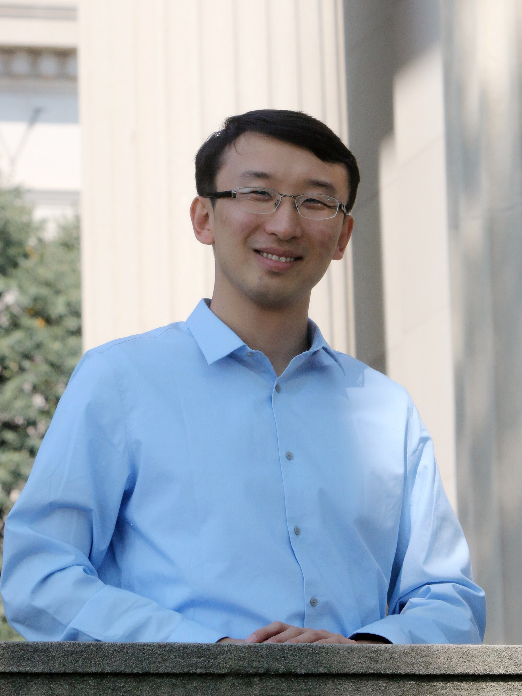

Assistant Professor 
Department of Mathematics 
Massachusetts Institute of Technology

<strong>Email:</strong>


<strong>Office:</strong> <a href="http://whereis.mit.edu/?go=2" target="_blank">2-271</a>

<strong>Mail:</strong> 
MIT Department of Mathematics 
77 Massachusetts Ave, Room 2-271 
Cambridge, MA 02139, USA

## Research areas

Combinatorics, discrete mathematics, graph theory

[**MIT Combinatorics Seminar**](http://math.mit.edu/seminars/combin/)

## Teaching

**Current** (Fall 2017 at MIT)

* [18.A34 Mathematical Problem Solving Seminar](a34/)
* [18.S997 Graph Theory and Additive Combinatorics](gtac/)

**Previous**

* [Polynomial Method in Combinatorics](pm16/), Trinity Term 2016, Oxford

### [Math Olympiad training handouts](olympiad/)

## Videos

* <a href="javascript:void(0);" target="_self" onclick="$('#simons-talk-dec2013').toggle('fast');">
  Green-Tao theorem and a relative Szemerédi theorem</a>, Simons Institute, Berkeley, Dec 2013
  

  <iframe width="560" height="315" src="//www.youtube.com/embed/vsFFjhYLVrM" allowfullscreen></iframe>
  

* <a href="javascript:void(0);" target="_self" onclick="$('#simons-talk-jan2017').toggle('fast');">
  Sparse graph regularity tutorial</a>, Simons Institute, Berkeley, Jan 2017
  

  <iframe width="560" height="315" src="//www.youtube.com/embed/ZXLtAj4eL0c" allowfullscreen></iframe>
  

* <a href="javascript:void(0);" target="_self" onclick="$('#simons-talk-apr2017').toggle('fast');">
  Large deviations for arithmetic progressions</a>, Simons Institute, Berkeley, Apr 2017
  

  <iframe width="560" height="315" src="//www.youtube.com/embed/G9AJHUAz33o" allowfullscreen></iframe>
  

## Short CV

* Ph.D. Mathematics, MIT, 2015 (Advisor: [Jacob Fox](http://stanford.edu/~jacobfox/))
* M.A.St. Mathematics with Distinction, Cambridge, 2011
* S.B. Mathematics, MIT, 2010
* S.B. Computer Science and Engineering, MIT, 2010

Previous institutions: Oxford, Berkeley, Microsoft Research
