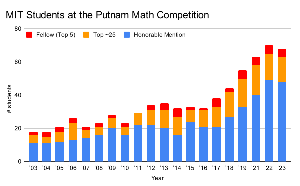

Associate Professor of Mathematics 
Department of Mathematics 
Massachusetts Institute of Technology

<strong>Email:</strong>


<strong>Office:</strong> <a href="http://whereis.mit.edu/?go=2" target="_blank">2-271</a>

<strong>Mail:</strong> 
MIT Department of Mathematics 
77 Massachusetts Ave, Bldg 2-271 
Cambridge, MA 02139, USA

**Research Interests:** Combinatorics 
* Extremal, probabilistic, and additive combinatorics
* Graph theory; discrete geometry; applications to computer science

**Current PhD Students**:
[Travis Dillon](https://travisadillon.com/),
[Dingding Dong](https://sites.google.com/view/dingding-dong/),
[Nitya Mani](https://www.mit.edu/~nmani/),
[Ashwin Sah](http://www.mit.edu/~asah/),
[Mehtaab Sawhney](http://www.mit.edu/~msawhney/)

**Former PhD Students**:
[Benjamin Gunby](https://sites.google.com/view/benjamingunby/),
[Jonathan Tidor](https://web.stanford.edu/~jtidor/),
[Aaron Berger](https://web.mit.edu/bergera/www/)

See my [blog](blog/) for discussions of recent research from my group

**Service**

- Co-organizer, [Richard P. Stanley Seminar in Combinatorics](http://math.mit.edu/seminars/combin/)

- Associate Editor, [Advances in Mathematics](https://www.journals.elsevier.com/advances-in-mathematics)

- Editorial Advisory Board Member, [Springer Graduate Texts in Mathematics](https://www.springer.com/series/136)

[ &nbsp;&nbsp;
  ](gtacbook/)

### [(Book) Graph Theory and Additive Combinatorics: Exploring Structure and Randomness](gtacbook/)

_[Cambridge University Press](https://www.cambridge.org/core/books/graph-theory-and-additive-combinatorics/90A4FA3C584FA93E984517D80C7D34CA) 2023_
   
   

Lecture videos on [MIT OpenCourseWare](https://ocw.mit.edu/18-217F19) and [YouTube](https://www.youtube.com/playlist?list=PLUl4u3cNGP62qauV_CpT1zKaGG_Vj5igX)

## Teaching

* [18.226 Probabilistic Methods in Combinatorics](pm/) (grad), Fall 2022
   
   
* [18.A34 Mathematical Problem Solving (Putnam Seminar)](a34/), Fall 2022
  
  \\
  _Putnam Competition results_
  [_2022_](a34/putnam/2022winners.pdf),
  [_2021_](a34/putnam/2021winners.pdf),
  <!--   -->
  [_2019_](a34/putnam/2019winners.pdf),
  <!--  \\ -->
  [_2018_](a34/putnam/2018winners.pdf),
  [_2017_](a34/putnam/2017winners.pdf)  
  

* [18.225 Graph Theory and Additive Combinatorics](gtac/) (grad), Fall 2021
   
   
   
   
* [18.211 Combinatorial Analysis](211/), Fall 2018
* [Polynomial Method in Combinatorics](pm16/) (grad), Trinity Term 2016, Oxford
* [Math Olympiad training handouts](olympiad/)

## Selected papers

* [Nearly all $k$-SAT functions are unate](https://arxiv.org/abs/2209.04894)
  (with József Balogh, Dingding Dong, Bernard Lidický, and Nitya Mani) \\
  _ACM Symposium on Theory of Computing (STOC 2023)_
* [Joints of varieties](https://arxiv.org/abs/2008.01610) (with Jonathan Tidor and Hung-Hsun Hans Yu) \\
  _Geometric and Functional Analysis_ 32 (2022) 302--339
* [Testing linear-invariant properties](https://arxiv.org/abs/1911.06793) (with Jonathan Tidor)  \\
  _IEEE Symposium on Foundations of Computer Science (FOCS)_ 2020 \\
  _SIAM Journal on Computing_ 51 (2022), 1230--1279
* [Equiangular lines with a fixed angle](https://arxiv.org/abs/1907.12466) (with Zilin Jiang, Jonathan Tidor, Yuan Yao, and Shengtong Zhang) \\
  _Annals of Mathematics_ 194 (2021), 729--743. 
* [A reverse Sidorenko inequality](https://arxiv.org/abs/1809.09462) (with Ashwin Sah, Mehtaab Sawhney, and David Stoner) \\
  _Inventiones Mathematicae_ 221 (2020), 665--711
* [Upper tails and independence polynomials in random graphs](http://arxiv.org/abs/1507.04074)
  (with Bhaswar B. Bhattacharya, Shirshendu Ganguly, and Eyal Lubetzky) \\
  _Advances in Mathematics_ 319 (2017), 313--347
* [A relative Szemerédi theorem](http://arxiv.org/abs/1305.5440)
  (with David Conlon and Jacob Fox) \\
  _Geometric and Functional Analysis_ 25 (2015), 733--762
* [Sphere packing bounds via spherical codes](http://arxiv.org/abs/1212.5966)
  (with Henry Cohn) \\
  _Duke Mathematical Journal_ 163 (2014), 1965--2002

## Slides

* [Equiangular lines and eigenvalue multiplicities](research/slides/equiangular.pdf)
* [Extremal problems in discrete geometry](research/slides/extremal_discrete_geometry.pdf)
* [The joints problem for varieties](research/slides/joints_varieties.pdf)
* [Popular common difference](research/slides/popular_difference.pdf)
* [Regularity method for sparse graphs and its applications](research/slides/sparse-reg-c4.pdf)
* [A reverse Sidorenko inequality: independent sets, colorings, and graph homomorphisms](research/slides/reverse_sidorenko_slides.pdf)
* [Large deviations in random graphs](research/slides/large_deviations_random_graphs.pdf)
* [Pseudorandom graphs, relative Szemerédi theorem and the Green-Tao Theorem](research/slides/green-tao-relative-szemeredi.pdf)

## Videos

* [Equiangular lines and eigenvalue multiplicities](https://www.youtube.com/watch?v=3U15EBoisxY), Waterloo Algebraic Graph Theory Seminar, Aug 2022
* [The joints problem for varieties](https://youtu.be/dsnU8iPL-WI), Big Seminar by Laboratory of Combinatorial and Geometric Structures, Aug 2020
* [Popular common difference](https://youtu.be/TCGZgTUjE3s), Webinar in Additive Combinatorics, May 2020
* [Equiangular lines with a fixed angle](http://www.birs.ca/events/2019/5-day-workshops/19w5009/videos/embed/201909021422-Zhao.mp4), Banff International Research Station, Sep 2019
* [Large deviations and exponential random graphs](https://youtu.be/dwUz8c7siDU), Northeastern University Network Science Institute, May 2018
* [Sparse graph regularity tutorial](https://youtu.be/ZXLtAj4eL0c), Simons Institute, Berkeley, Jan 2017
* [Green--Tao theorem and a relative Szemerédi theorem](https://youtu.be/vsFFjhYLVrM), Simons Institute, Berkeley, Dec 2013

Also see [Youtube playlist](https://www.youtube.com/playlist?list=PLhQ4Q5PF7ZDkx0ECL2TiRBCHrY0MsXgae) for more videos

## Short CV

* NSF CAREER award, 2021
* [Sloan Research Fellowship](http://news.mit.edu/2019/four-from-mit-named-sloan-research-fellows-0221), 2019
* [Dénes König Prize](https://www.siam.org/prizes/sponsored/konig.php), 2018
* Ph.D. Mathematics, MIT, 2015 (Advisor: [Jacob Fox](http://stanford.edu/~jacobfox/))
* M.A.St. Mathematics with Distinction, Cambridge, 2011
* S.B. Mathematics, MIT, 2010
* S.B. Computer Science and Engineering, MIT, 2010
* Previous affiliations: Oxford, Berkeley, Stanford, Microsoft Research