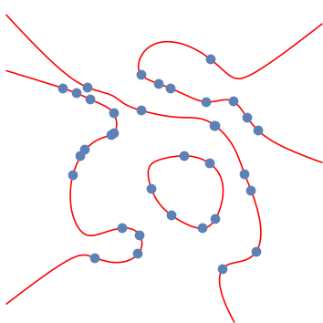

Polynomial Method in Combinatorics
==================================

Graduate course, Trinity Term 2016

**Instructor:** [Dr Yufei Zhao](http://yufeizhao.com)

**Time:** Tuesday 10---11.30

**Location:** C3 (week 1), C4 (weeks 2---8) 
Mathematical Institute, University of Oxford

## Course description

We study a number of surprising applications of polynomials to problems in combinatorics. Many of these results were discovered only in the past decade, and their solutions are often surprising and short. The method provided solutions to a number of long standing open problems that appear to have little to do with polynomials, such as the finite field Kakeya conjecture and the joints problem. The method also played a central role in the solution of the Erdős distinct distance problem. In this course, we will examine these solutions, and understand how algebraic structure arises naturally in problems in combinatorial geometry and coding theory.

Here are some examples of results that will be discussed in this course. The first two have very short proofs. The third is much more involved, and we will be discussing many of the ideas that go into its proof.

**Finite field Kakeya problem.** ([Dvir](http://arxiv.org/abs/0803.2336))
If $A \subset \mathbb{F}_q^n$ contains a line in every direction, then $|A| \ge c_n q^n$.

**Joints problem.** ([Guth--Katz](http://arxiv.org/abs/0812.1043))
Any $N$ lines in $\mathbb{R}^3$ contain at most $O(N^{3/2})$ joints, where a _joint_ is a point incident to three non-coplanar lines.

**Erdős distinct distance problem.** ([Guth--Katz](http://arxiv.org/abs/1011.4105))
Any $N$ points in $\mathbb{R}^2$ have at least $c N/\log N$ distinct pairwise distances.

## Lectures

[Scribe notes](scribe.pdf) by Eric Naslund

- **Lecture 1** --- 26 April 2016 [[Board photos]](lec1board.pdf)  
  Introduction. Basic method (parameter counting and vanishing lemma). Finite field Nikodym and Kakeya problems. Joints problem.

- **Lecture 2** --- 3 May 2016  
  Finite field Kakeya without polynomials -- bush method and Wolff's hairbrush argument. What's so special about polynomials? Algebraic examples: Hermitian variety, doubly ruled surfaces.

- **Lecture 3** --- 10 May 2016 [[Board photos]](lec3board.pdf)  
  Remarks on [Croot--Lev--Pach](https://arxiv.org/abs/1605.01506) result on progression-free sets in $\mathbb{Z}_4^n$. Linear algebraic method in combinatorics---distinct distances in high dimensions. The polynomial method in error correcting codes: Berlekamp--Welch algorithm and Sudan list decoding algorithm; Reed--Solomon and Reed--Muller codes.

- **Lecture 4** --- 17 May 2016 [[Board photos]](lec4board.pdf)  
  Szemerédi--Trotter theorem on point-line incidences in the plane. The cutting method. Polynomial partitioning method.  
  _References_: [Matoušek's note](matousek-szt-poly.pdf), [Tao's blog](https://terrytao.wordpress.com/2011/02/18/the-szemeredi-trotter-theorem-via-the-polynomial-ham-sandwich-theorem/).

- **Lecture 5** --- 24 May 2016 [[Board photos]](lec5board.pdf)  
  Proof of Szemerédi--Trotter using polynomial partitioning. Elekes--Sharir framework. Partial symmetries of the plane. Reduction of the distinct distances problem to incidence geometry of lines in $\mathbb{R}^3$.  
  _Reference_:  [Guth--Katz Section 2](https://dx.doi.org/10.4007/annals.2015.181.1.2)

- **Lecture 6** --- 31 May 2016 [[Board photos]](lec6board.pdf)  
  Reguli. Algebraic structure and degree reduction.  
  _Reference_:  [Guth Lecture notes](http://math.mit.edu/~lguth/PolyMethod/lect12.pdf)

- **Lecture 7** --- 7 June 2016 [[Board photos]](lec7board.pdf)  
  Proof of the planar clustering theorem. Flat and critical points. Plane detection lemma.  
  _Reference_:  Guth Lecture notes [14](http://math.mit.edu/~lguth/PolyMethod/lect14.pdf) and [15](http://math.mit.edu/~lguth/PolyMethod/lect14.pdf)

- **Lecture 8** --- 14 June 2016 [[Board photos]](lec8board.pdf)  
  Outline of the rest of the proof of the Guth--Katz theorem. Classification of doubly ruled surfaces. Flecnodes. Szemerédi--Trotter type theorem in 3-dimensions.

## [Homework exercises](exercises.pdf)

## References

This course is based on [another course](http://math.mit.edu/~lguth/PolynomialMethod.html) taught by Larry Guth at MIT in Fall 2012\. Notes from that course are available from its website.

The following survey discusses many of the topics that will be examined in this course:

- Larry Guth, [Unexpected applications of polynomials in combinatorics](http://math.mit.edu/~lguth/Exposition/erdossurvey.pdf)
